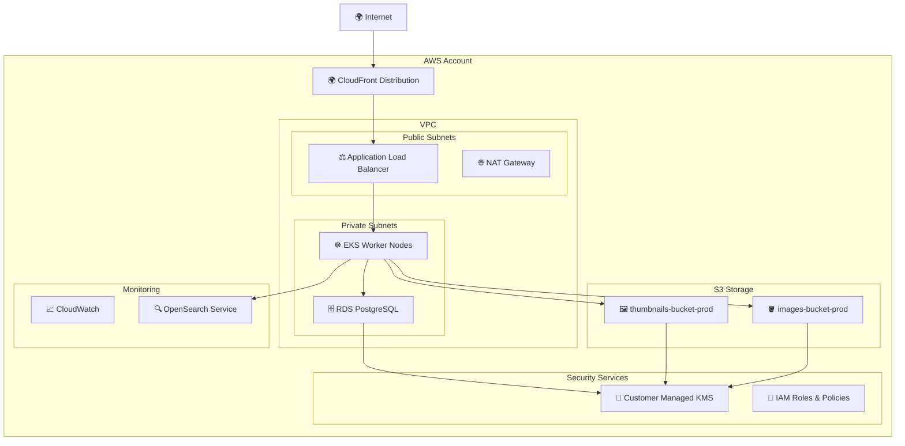
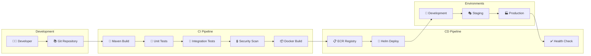

# 🚀 Deployment Diagramme

## 🏗️ AWS Infrastructure



## ☸️ Kubernetes Resources

```mermaid
graph TB
    subgraph "Namespace: image-service"
        subgraph "Workloads"
            Deployment[📦 image-service-deployment]
            ReplicaSet[🔄 ReplicaSet (3 replicas)]
            
            subgraph "Pod Template"
                Container[🍃 image-service:v1.0.0]
                InitContainer[🔧 migration-init]
                SidecarLog[📊 fluent-bit]
            end
        end
        
        subgraph "Configuration"
            ConfigMap[⚙️ image-service-config]
            Secret[🔐 image-service-secrets]
            ServiceAccount[👤 image-service-sa]
        end
        
        subgraph "Networking"
            Service[🌐 image-service-svc]
            Ingress[🚪 image-service-ingress]
        end
        
        subgraph "Storage"
            PVC[💾 image-cache-pvc]
        end
    end
    
    Deployment --> ReplicaSet
    ReplicaSet --> Container
    Container --> ConfigMap
    Container --> Secret
    Container --> ServiceAccount
    Container --> PVC
    Service --> Container
    Ingress --> Service
```

## 🔄 CI/CD Pipeline

