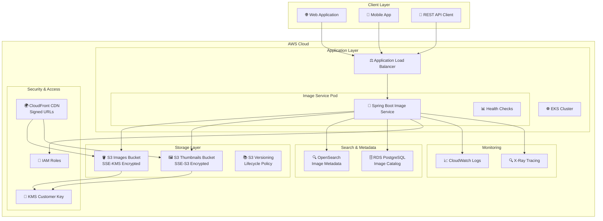
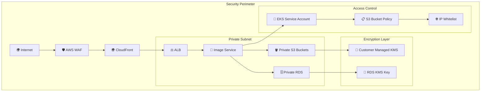
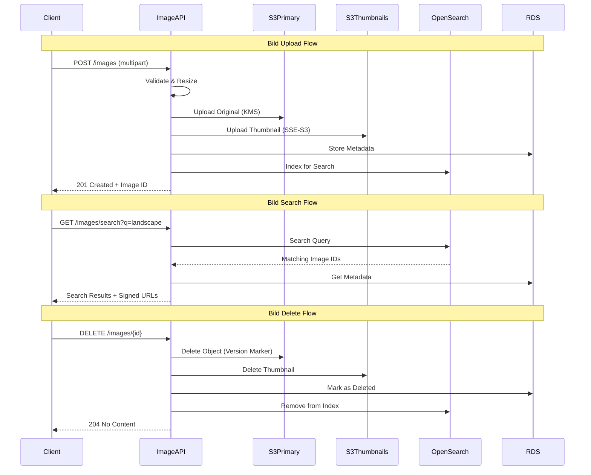
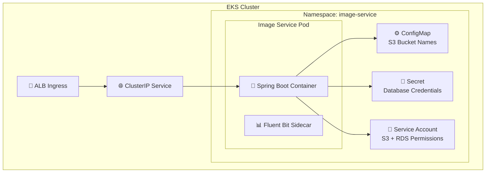

# 🖼️ AWS S3 Bildspeicher Architektur

## 🏗️ System-Architektur

## 🔒 Security Architecture

## 📊 Datenfluss-Diagramm

## 🏗️ Kubernetes Deployment

## 🔧 Technische Komponenten

### Storage Strategy

- **S3 Primary Bucket**: Original-Bilder mit KMS-Verschlüsselung
- **S3 Thumbnails Bucket**: Optimierte Vorschaubilder mit SSE-S3
- **Versioning**: Aktiviert für Wiederherstellung gelöschter Bilder
- **Lifecycle Policy**: Automatische Archivierung nach 90 Tagen

### Search & Metadata

- **OpenSearch**: Volltext-Suche in Bild-Metadaten und Tags
- **RDS PostgreSQL**: Strukturierte Metadaten und Beziehungen
- **Indexing Strategy**: Asynchrone Indizierung via SQS/Lambda

### Security Features

- **KMS Customer Managed Keys** für sensible Bilder
- **IAM Roles** mit Least-Privilege-Prinzip
- **Bucket Policies** mit IP-Whitelist und HTTPS-Only
- **CloudFront Signed URLs** für zeitbegrenzten Zugriff

### Performance Optimierung

- **CloudFront CDN** für globale Bildauslieferung
- **Multi-Size Thumbnails** (150px, 300px, 600px)
- **Lazy Loading** mit Progressive JPEG
- **Connection Pooling** für S3 und RDS
